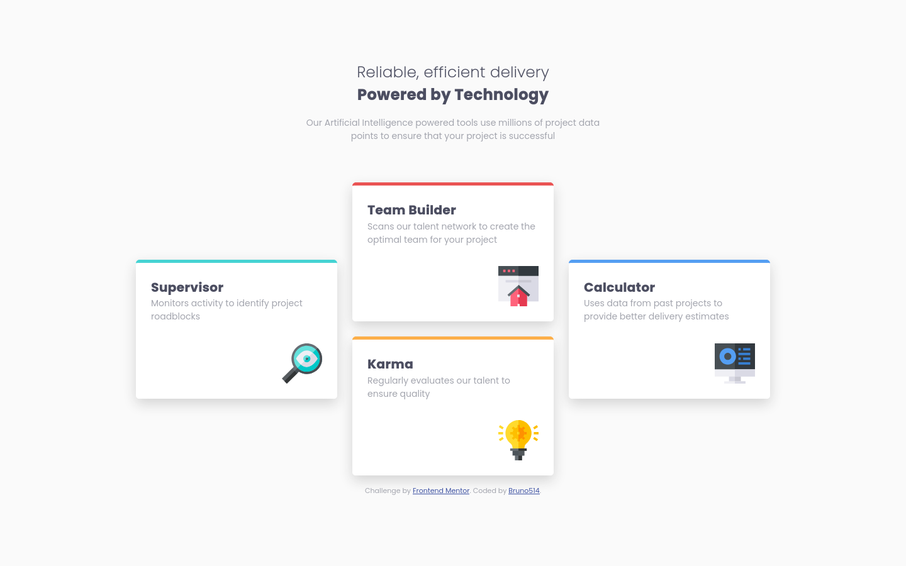

# Frontend Mentor - Four card feature section solution

This is a solution to the [Four card feature section challenge on Frontend Mentor](https://www.frontendmentor.io/challenges/four-card-feature-section-weK1eFYK). Frontend Mentor challenges help you improve your coding skills by building realistic projects.

## Table of contents

- [Overview](#overview)
  - [The challenge](#the-challenge)
  - [Screenshot](#screenshot)
  - [Links](#links)
- [My process](#my-process)
  - [Built with](#built-with)
  - [What I learned](#what-i-learned)
  - [Continued development](#continued-development)
  - [Useful resources](#useful-resources)
- [Author](#author)
- [Acknowledgments](#acknowledgments)

## Overview

### The challenge

Users should be able to:

- View the optimal layout for the site depending on their device's screen size

### Screenshot



### Links

- Solution URL: [Add solution URL here](https://your-solution-url.com)
- Live Site URL: [https://bruno514.github.io/Four-Card-Feature-Section/](https://bruno514.github.io/Four-Card-Feature-Section/)

## My process

### Built with

- Semantic HTML5 markup
- Flexbox
- CSS Grid
- Mobile-first workflow
- [Sass](https://sass-lang.com/) - CSS Preprocessor

### What I learned

Learned a lot about the CSS grid. I now find it really useful for making responsive layouts. Also tried making my font responsive and worked pretty well with this code:

```css
font-size: clamp(1rem, calc(1rem + 2vw), 2rem);
```

### Useful resources

- [A Interactive Guide to CSS Grid](https://www.joshwcomeau.com/css/interactive-guide-to-grid/) - This helped me a lot with keeping interest learning the grid layout.

## Author

- Frontend Mentor - [@Bruno514](https://www.frontendmentor.io/profile/Bruno514)
